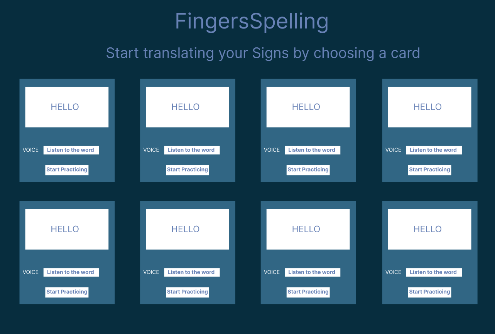

# Sign Language detection Using Python , OpenCV, mediapipe and tkinter for hte GUI with an added feature ot listen to the word that the sign represents

## prerequisite 

* Python 
* IDE (VS code)
* cv2 (openCV) 
* mediapipe 
* Tkinter 
* pyttsx3

## GUI wireframe
